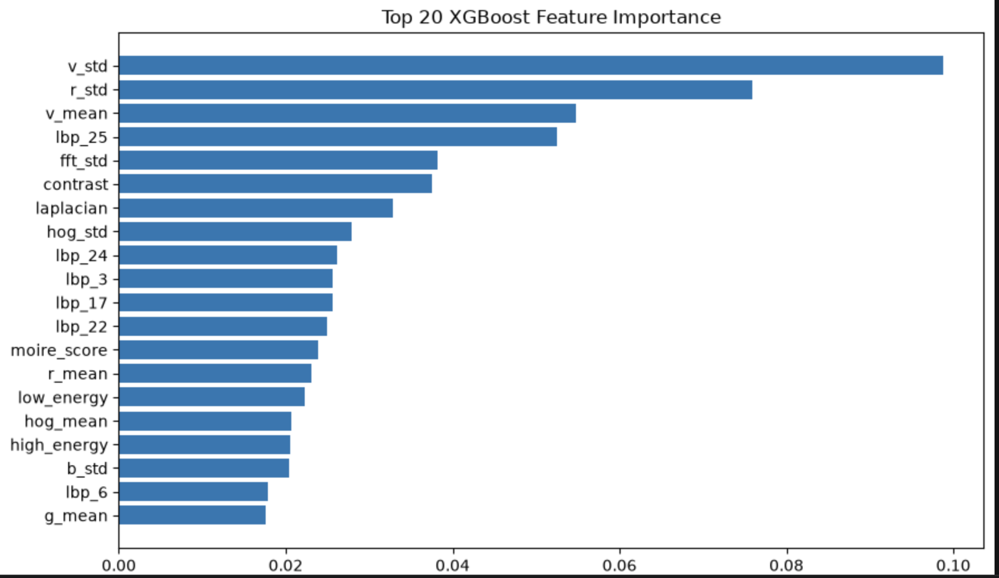

# Spot the Fake Photo: Real vs Screen Recapture Detection

<p align="center">

A lightweight computer vision system for detecting whether an image is a genuine photograph or a photograph of a digital screen.

Built using PyTorch • Transfer Learning • Streamlit

</p>

---

## Overview

Screen recapture fraud occurs when an existing image is displayed on a phone, laptop, monitor, or tablet and photographed again to bypass image verification systems.

Although these images often appear visually similar to genuine photographs, they contain subtle artifacts introduced by display hardware and the camera imaging pipeline, including:

- Moiré patterns
- Pixel grid artifacts
- Reflection patterns
- Frequency-domain distortions
- Brightness inconsistencies
- Texture differences

This project presents a lightweight deep learning solution capable of distinguishing between real photographs and screen recaptures in real time.

The project was developed as part of the **SalesCode AI Computer Vision Take-Home Assignment**.

### Project Highlights

- Custom dataset collected using a smartphone
- Classical Machine Learning baseline
- Deep Learning with Transfer Learning
- Stratified 5-Fold Cross Validation
- Real-time inference using PyTorch
- Interactive Streamlit web application
- Average inference latency of approximately **30–40 ms**
- Zero cloud inference cost

---

# Dataset

A custom dataset was created specifically for this assignment.

### Dataset Statistics

| Class | Images |
|--------|--------:|
| Real Photographs | 51 |
| Screen Recapture Photographs | 51 |
| **Total Images** | **102** |

The dataset contains images captured under different:

- Indoor environments
- Outdoor environments
- Different lighting conditions
- Multiple camera angles
- Various object categories
- Multiple backgrounds

The dataset was intentionally balanced to avoid class imbalance during training.

---

## Sample Real Photographs

<p align="center">

</p>

---

## Sample Screen Recapture Photographs

<p align="center">

</p>

---

# Assignment Requirements

The assignment required the following:

- Collect approximately 50 real photographs
- Collect approximately 50 photographs of digital screens
- Build a detector capable of distinguishing between both classes
- Implement a `predict.py` script that outputs a fraud score between **0** and **1**
- Measure inference latency
- Estimate deployment cost per image
- Explain the overall methodology
- (Optional) Develop a demonstration application

This repository satisfies all of the above requirements.

---

# Problem Statement

Many identity verification systems require users to capture live photographs for authentication.

A common fraudulent technique involves displaying an existing photograph on another electronic device such as:

- Mobile Phone
- Laptop
- Monitor
- Tablet

The displayed image is then photographed again to imitate a genuine capture.

Since these screen recaptures closely resemble real photographs, detecting them becomes a challenging computer vision problem.

The objective of this project is to automatically classify an image as either:

- **Real Photograph**
- **Screen Recapture**

while maintaining low latency suitable for real-time deployment.

---

# Project Workflow

The complete pipeline followed during development is illustrated below.

```text
Data Collection
        │
        ▼
Exploratory Data Analysis
        │
        ▼
Feature Engineering
        │
        ▼
Classical Machine Learning
(Random Forest & XGBoost)
        │
        ▼
Transfer Learning
        │
        ▼
5-Fold Cross Validation
        │
        ▼
Model Comparison
        │
        ▼
Final ResNet34 Training
        │
        ▼
Prediction Script
        │
        ▼
Streamlit Deployment
```

---

# Exploratory Data Analysis

Before training any model, the dataset was analyzed to better understand its characteristics.

The exploratory analysis included:

- Class distribution
- Sample image visualization
- RGB channel statistics
- Image dimensions
- Pixel intensity distribution
- Dataset balance verification

These analyses confirmed that the collected dataset was balanced and appropriate for experimentation.

---

# Feature Engineering

To establish a strong classical machine learning baseline, handcrafted visual features were extracted from every image.

The extracted features capture texture, frequency information, edges, reflections, and color statistics commonly observed in screen recapture images.

### Extracted Features

- Fast Fourier Transform (FFT)
- Histogram of Oriented Gradients (HOG)
- Local Binary Patterns (LBP)
- Laplacian Variance
- Edge Density
- Reflection Features
- Color Statistics
- Brightness Statistics
- Texture Descriptors

The generated feature vectors were stored in:

```text
engineered_features.csv
```

These handcrafted features were later used to train Random Forest and XGBoost classifiers before moving to deep learning approaches.

---

# Classical Machine Learning

Two classical machine learning algorithms were trained using the engineered feature vectors.

The goal was to establish a strong baseline before experimenting with transfer learning models.

The evaluated models were:

- Random Forest
- XGBoost

---

## Random Forest

The engineered feature vectors were first evaluated using a Random Forest classifier.

### Performance

| Metric | Score |
|---------|------:|
| Mean Accuracy | 80.29% |
| Precision | 84.86% |
| Recall | 78.36% |
| F1 Score | 80.00% |
| Best Fold Accuracy | 90.48% |

The Random Forest model provided a strong baseline and demonstrated that handcrafted features alone could effectively distinguish between real photographs and screen recapture images.

---

## XGBoost

To further improve performance, an XGBoost classifier was trained using the same engineered features.

### Performance

| Metric | Score |
|---------|------:|
| Mean Accuracy | 83.29% |
| Precision | 88.78% |
| Recall | 78.36% |
| F1 Score | 82.21% |
| Best Fold Accuracy | 90.48% |

XGBoost outperformed Random Forest by learning more discriminative decision boundaries from the engineered features.

---

## Feature Importance

The feature importance plot below illustrates the most influential handcrafted features learned by the XGBoost model.

Among the extracted features, statistics derived from the HSV color space, Local Binary Patterns (LBP), Fast Fourier Transform (FFT), Histogram of Oriented Gradients (HOG), and Laplacian-based texture descriptors contributed most significantly to the classification task.

<p align="center">

</p>

---

# Deep Learning

Although classical machine learning models achieved encouraging performance, handcrafted features may fail to capture complex visual patterns introduced by modern display technologies.

To overcome this limitation, multiple lightweight convolutional neural networks pretrained on ImageNet were evaluated using transfer learning.

### Models Evaluated

- MobileNetV3 Small
- EfficientNet-B0
- ShuffleNetV2
- ResNet18
- ResNet34

Each model was fine-tuned on the custom dataset while replacing the final classification layer with a two-class classifier.

---

# Training Strategy

The following training strategy was adopted for every deep learning model:

- Transfer Learning using ImageNet pretrained weights
- Stratified 5-Fold Cross Validation
- AdamW Optimizer
- CrossEntropy Loss
- Learning Rate Scheduling
- Early Stopping
- Best Model Checkpoint Saving

This strategy ensured fair comparison across all evaluated architectures while reducing overfitting on the relatively small dataset.

---

# Data Augmentation

The following augmentations were applied during training:

- Resize to **224 × 224**
- Random Horizontal Flip
- Random Crop
- Color Jitter
- ImageNet Normalization

These augmentations improved the robustness and generalization capability of the models by exposing them to diverse visual variations.

---

# Model Benchmark

Every model was evaluated using **Stratified 5-Fold Cross Validation**.

| Model | Mean Accuracy | Precision | Recall | F1 Score | Best Fold |
|------|------:|------:|------:|------:|------:|
| Random Forest | 80.29% | 84.86% | 78.36% | 80.00% | 90.48% |
| XGBoost | 83.29% | 88.78% | 78.36% | 82.21% | 90.48% |
| MobileNetV3 Small | 77.52% | 80.33% | 74.55% | 77.12% | 95.00% |
| EfficientNet-B0 | 82.52% | 86.27% | 78.36% | 81.52% | 100.00% |
| ResNet18 | 81.33% | 79.67% | 84.55% | 81.78% | 90.48% |
| **ResNet34** | **85.33%** | **82.27%** | **90.36%** | **86.06%** | **95.00%** |

Among all evaluated approaches, **ResNet34** achieved the highest average accuracy and F1-score, demonstrating the best overall balance between precision and recall.

---

# Final Model Selection

Although EfficientNet-B0 achieved a perfect validation score on one fold, its average performance across all folds was lower than that of ResNet34.

ResNet34 consistently achieved superior results across multiple validation splits, indicating stronger generalization capability.

For this reason, **ResNet34** was selected as the final deployment model.

The final network was retrained using the complete dataset (102 images) to maximize the available training data before deployment.

Final model weights:

```text
models/final_resnet34_detector.pth
```

---

# Model Performance

The final ResNet34 model achieved the following performance during Stratified 5-Fold Cross Validation.

| Metric | Score |
|--------|-------:|
| Mean Accuracy | **85.33%** |
| Precision | **82.27%** |
| Recall | **90.36%** |
| F1 Score | **86.06%** |
| Best Fold Accuracy | **95.00%** |

These results demonstrate that the model is capable of accurately distinguishing between genuine photographs and screen recaptures while remaining lightweight enough for real-time deployment.

---

# Streamlit Demo

An interactive Streamlit web application was developed to demonstrate the trained model.

The application provides:

- Image upload interface
- Fraud score prediction
- Confidence scores for both classes
- Inference latency
- Model benchmark
- Deployment information
- Real-time prediction

Run the application locally using:

```bash
streamlit run app.py
```

---

## Real Photograph Prediction

The example below shows a genuine photograph correctly classified by the deployed model.

<p align="center">

</p>

---

## Screen Recapture Prediction

The example below shows a photograph of a digital screen correctly identified as a screen recapture.

<p align="center">

</p>

---

## Application Dashboard

The deployed application also provides evaluation metrics, benchmark results, deployment information, and model details.

<p align="center">

</p>

---

# Inference

The trained model is deployed through two inference interfaces:

1. Command Line Interface (`predict.py`)
2. Interactive Streamlit Web Application (`app.py`)

Both interfaces perform inference entirely on-device without requiring any cloud services.

---

## Command Line Inference

Run prediction on any image using:

```bash
python predict.py <image_path>
```

Example:

```bash
python predict.py dataset/real/image_1.jpeg
```

Example Output

```text
Fraud Score : 0.0342
Latency     : 31.54 ms
```

Another Example

```bash
python predict.py dataset/screen/image_1.jpeg
```

Example Output

```text
Fraud Score : 0.9688
Latency     : 34.81 ms
```

### Fraud Score Interpretation

| Fraud Score | Prediction |
|-------------|------------|
| 0.00 | Real Photograph |
| 0.00 – 0.49 | More likely to be a Real Photograph |
| 0.50 | Decision Threshold |
| 0.51 – 1.00 | More likely to be a Screen Recapture |
| 1.00 | Screen Recapture |

---

# Latency

Inference was performed on:

- Apple MacBook Air M2
- CPU Inference
- PyTorch

Average inference latency:

| Metric | Value |
|--------|------:|
| Average Latency | 30–40 ms / image |
| Framework | PyTorch |
| Device | Apple MacBook Air M2 |
| Deployment | On-device |

The lightweight architecture enables real-time inference without requiring dedicated GPU hardware.

---

# Cost Per Image

The model performs inference entirely on-device using PyTorch.

No external APIs, cloud servers, or third-party inference services are required.

| Metric | Cost |
|--------|------|
| Cost per Image | Approximately $0 |
| Cost per 1,000 Images | Approximately $0 |
| Cost per 1 Million Images | Approximately $0 |

Since all inference is executed locally, the only runtime cost is the computational resources of the user's own device.

---

# Repository Structure

```text
RealVsScreenDetection/

├── assets/
│   ├── real_samples.jpeg
│   ├── screen_samples.jpeg
│   ├── xgboost_feature_importance.png
│   ├── app_real_prediction.png
│   ├── app_screen_prediction.png
│   └── app_dashboard.png
│
├── dataset/
│   ├── real/
│   └── screen/
│
├── models/
│   ├── final_resnet34_detector.pth
│   └── xgb_model.json
│
├── notebooks/
│   ├── 01_EDA.ipynb
│   ├── 02_Feature_Engineering.ipynb
│   ├── 03_Model_Training.ipynb
│   ├── 04_Transfer_Learning.ipynb
│   ├── 05_ResNet18_5Fold.ipynb
│   ├── 06_ResNet34_5Fold.ipynb
│   ├── 07_Final_Model_Training.ipynb
│   └── 08_Model_Evaluation.ipynb
│
├── predict.py
├── app.py
├── requirements.txt
└── README.md
```

---

# Installation

## Clone the Repository

```bash
git clone https://github.com/<your-username>/RealVsScreenDetection.git

cd RealVsScreenDetection
```

---

## Create a Virtual Environment

### Windows

```bash
python -m venv .venv

.venv\Scripts\activate
```

### macOS / Linux

```bash
python3 -m venv .venv

source .venv/bin/activate
```

---

## Install Dependencies

```bash
pip install -r requirements.txt
```

---

## Verify Installation

```bash
python predict.py dataset/real/image_1.jpeg
```

Example Output

```text
Fraud Score : 0.0342
Latency     : 31.54 ms
```

---

# Usage

## Command Line Prediction

```bash
python predict.py image.jpg
```

The script returns:

- Fraud Score
- Inference Latency

---

## Streamlit Application

Launch the interactive demo using:

```bash
streamlit run app.py
```

The web application provides:

- Image Upload
- Real-Time Prediction
- Fraud Score
- Confidence Scores
- Inference Latency
- Model Information
- Performance Benchmark

---

# Technologies Used

- Python
- PyTorch
- Torchvision
- OpenCV
- NumPy
- Pandas
- Scikit-learn
- XGBoost
- Matplotlib
- Streamlit

---

# Future Improvements

Possible future enhancements include:

- Collect a significantly larger dataset covering more real-world scenarios.
- Capture images using multiple smartphones and camera sensors.
- Include additional display technologies such as LCD, OLED, AMOLED, and Mini-LED.
- Apply hard-negative mining to improve robustness against difficult examples.
- Perform model quantization for faster mobile inference.
- Export the model using TorchScript or ONNX for optimized deployment.
- Investigate Vision Transformers and self-supervised learning approaches.
- Build a REST API for cloud deployment.
- Extend the detector to video-based screen recapture detection.

---

# Conclusion

This project presents a complete end-to-end computer vision pipeline for detecting screen recapture fraud.

The work began with collecting a custom dataset of genuine photographs and screen recaptures, followed by exploratory data analysis, handcrafted feature extraction, classical machine learning experiments, and transfer learning using multiple lightweight convolutional neural networks.

Several deep learning architectures—including MobileNetV3, EfficientNet-B0, ShuffleNetV2, ResNet18, and ResNet34—were systematically evaluated using Stratified 5-Fold Cross Validation. In addition, Random Forest and XGBoost were trained on handcrafted visual descriptors to establish strong classical baselines.

Among all evaluated models, **ResNet34** achieved the best balance between accuracy, robustness, and inference speed, obtaining a **mean cross-validation accuracy of 85.33%**, a **mean F1-score of 86.06%**, and a **best-fold accuracy of 95.00%**. Although EfficientNet-B0 achieved a perfect validation score on one fold, ResNet34 demonstrated more consistent performance across all validation splits and was therefore selected for deployment.

The final model performs inference entirely on-device with an average latency of approximately **30–40 milliseconds per image**, requires **no cloud infrastructure**, and incurs **effectively zero inference cost**, making it well suited for lightweight real-time deployment.

This project demonstrates a complete machine learning workflow—from data collection and experimentation to model comparison, deployment, and user-facing application development—and provides a practical solution for detecting screen recapture fraud in image verification systems.